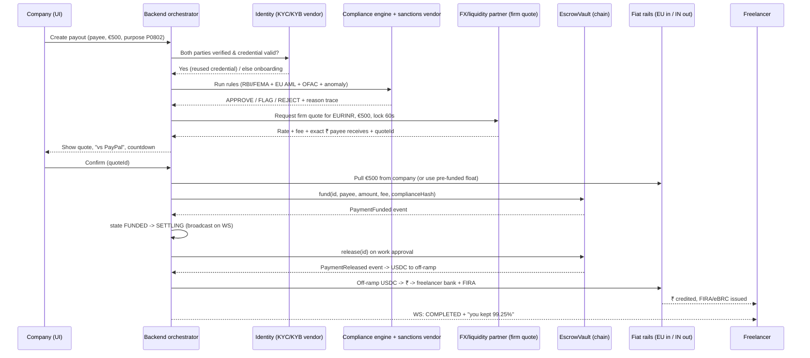

# GigBridge — Product Scope, Due-Diligence & Gap Analysis
### From "impressive demo" to "software people can actually move money through"

> **Read this as if a serious investor commissioned it.** The tone is deliberately
> unflattering where it needs to be. The goal is not to make GigBridge look good;
> it's to tell you exactly how far it is from real, and exactly what closes the gap.

---

## 0. TL;DR (the verdict first)

**Where it stands today:** GigBridge is a *very well-written specification with zero code*.
The repository contains five planning documents (PRD, TRD, UI spec, 3-day roadmap,
demo script) and an integration contract. There is no `/contracts`, no `/backend`,
no `/frontend`. Nothing runs. The "four contracts" you mentioned exist only as
Solidity *descriptions* in `TRD.txt`, not as files.

**The honest maturity ladder** — and be clear-eyed about which rung you're on:

| Rung | What it is | GigBridge status |
|------|-----------|------------------|
| 0. Spec | Documents describing the product | ✅ **You are here** |
| 1. Mock demo | UI + fake data, nothing real moves | ⬜ (the 3-day plan builds this) |
| 2. Testnet demo | Real smart contracts on a test chain, mock money, mock KYC | ⬜ |
| 3. Mainnet demo | Real chain, real stablecoin — *but still no fiat, no license, no real users* | ⬜ ← **your instinct is correct: this is still a demo** |
| 4. Regulated pilot | Real KYC/AML, licensed partners, real fiat in and out, 5–20 real users, real money | ⬜ ← **this is the first rung that is "real software"** |
| 5. Product/business | Scaled, audited, monitored, profitable unit economics | ⬜ |

Your intuition — *"even with real blockchain it's just a mainnet demo"* — is **exactly
right**, and it's the single most important insight in this whole analysis. **The
blockchain is not the hard part and not the thing that makes it real.** Rungs 2→3
(making the chain real) is maybe 10% of the remaining work. Rungs 3→4 (making the
*fiat edges, the licenses, and the compliance* real) is the other 90%, and almost
none of it is code you or I write — it's licenses, partners, capital, and audits.

**So the correct mental correction is:** stop thinking "how many more contracts do I
add." Start thinking "who are my licensed rails, who verifies identity, where does
executable FX come from, who audits me, and who holds the money." Those five answers
*are* the product.

---

## 1. Current scope — what the spec actually commits to

### 1.1 The product in one paragraph
A company in Country A pays a freelancer in Country B directly. An "autonomous agent"
verifies both parties once (reusable credential), runs a jurisdiction-aware compliance
rule engine on both countries, locks an FX rate, moves value over a blockchain
settlement layer (EUR → USDC → INR), and lands the payout — in minutes, at <1%,
versus 8–10% and 3–5 days for PayPal/wires. Three dashboards: Company, Freelancer,
Admin.

### 1.2 What the documents define (the intended scope)
- **4 smart contracts:** `MockUSDC` (fake stablecoin), `IdentityRegistry` (credential
  hash + expiry, no PII on-chain), `EscrowVault` (fund → release/refund/freeze), `AuditAnchor`
  (hash of each compliance decision).
- **Backend (modular monolith, Fastify/TS/Prisma/Postgres):** auth+RBAC, KYC/KYB state
  machine, payment orchestrator (a 10-state machine), FX service, a **deterministic
  10-rule compliance engine** (RBI/FEMA, EU AMLD/GDPR, US OFAC + velocity/structuring/
  outlier), an **LLM "explainer"** (Claude explains, rules decide), settlement service
  (viem), notifications, PDF docs.
- **Frontend (React/Vite/Tailwind):** 3 dashboards; centerpiece is a 4-step "New Payout"
  wizard with a live quote, "vs PayPal" strip, live compliance checklist, streaming
  agent reasoning, rate-lock countdown, and a live on-chain timeline.
- **Corridors:** EUR↔INR, USD↔INR only.
- **Explicit non-goals (stated honestly in the PRD):** *not* a marketplace, *not* a
  licensed money transmitter, fiat edges *simulated*, KYC *mocked*, rules a
  *representative subset*, chain on *testnet*.

### 1.3 What this scope is genuinely good at
Give the spec its due — it is a **strong hackathon architecture**:
- The separation "**deterministic rules decide, LLM only explains**" is the right call
  and is exactly what an auditor or regulator wants to hear. Keep it forever.
- "**PII off-chain, only hashes on-chain**" is GDPR-correct by construction.
- Treating compliance rules as a **per-jurisdiction registry** ("each corridor is a
  rule pack, not a rebuild") is the correct moat framing.
- The state machine, the escrow-with-freeze, the audit anchor — all sensible.

**None of that is the problem.** The problem is everything the non-goals wave away.
Every "(simulated)", "(mock)", "(demo)", "(representative subset)" in the PRD is a line
item that, in the real world, is a company, a license, an integration, or an auditor —
and that is the actual product you'd be building.

---

## 2. The three questions you asked, answered directly

### 2.1 "Where does the live foreign-exchange rate come from?"

**Today (in the spec):** `frankfurter.app` / `exchangerate-api` — free, no key, with a
cached offline fallback.

**Why that is a demo-only answer — and the distinction that matters most:**
There are **two completely different kinds of FX rate**, and the spec only has the first:

1. **A *reference/indicative* rate** — "the mid-market rate is 89.5 INR/EUR." This is
   what Frankfurter gives you. It is the **European Central Bank's daily reference
   rate, published once per business day.** It is *not* real-time, *not* tradeable, and
   *not* a price anyone will actually give you money at. It's fine for the "vs PayPal"
   comparison strip and for display. It is useless as the rate you *settle* at.

2. **An *executable/dealable* rate** — the price at which a counterparty will *actually*
   convert EUR→USDC→INR *right now*, for your size, honoring it for your rate-lock
   window. **This is the rate the product must quote and settle on, and it does not
   come from a free API. It comes from whoever holds the FX risk and the liquidity.**

**So in production, "where does FX come from" has a real answer with three layers:**

- **Display/reference feed (cheap, licensed):** OANDA, Open Exchange Rates, Twelve Data,
  Polygon.io Forex, xignite, or LSEG/Refinitiv. Note most "free" feeds forbid commercial
  use — you'll pay for a data license. This layer only powers the *mid-market comparison*.
- **On-chain crypto-leg price:** **Chainlink price feeds** (EUR/USD, USDC/USD) if any
  conversion is decided on-chain.
- **The *real* rate — the executable quote — comes from your settlement/liquidity
  partner**, e.g. Circle, Nium, Currencycloud, Wise Platform, dLocal, Thunes, BVNK,
  or a stablecoin FX desk. **They quote you a firm price for the corridor and hold it
  for N seconds.** Your "rate lock" is only real if a counterparty is actually holding
  that price for you — otherwise you are carrying FX risk on every payment during the
  10-minute lock, which for a startup is an uncontrolled way to lose money.

**The uncomfortable consequence:** the moment your rate lock is real, **you are taking
FX risk** (the market can move between lock and settle). Real payment companies solve
this by (a) passing the risk to a liquidity partner who quotes firm, (b) hedging, or
(c) shortening the lock to seconds. The current 10-minute lock with a free daily
reference rate is a demo convenience that would bankrupt a real operator at volume.

> **Bottom line:** FX in the demo = one free API call. FX in production = a data license
> for display **plus** a liquidity/settlement partner who gives you firm, executable
> quotes and absorbs (or lets you hedge) the risk during the lock. This is a
> **partnership + treasury** problem, not a coding problem.

### 2.2 "When does the auditing happen — and what kind?"

"Audit" means at least **four different things** here, at four different times. The spec
only gestures at one (`forge` tests), which is not an audit.

| Audit type | What it checks | When it must happen | Who does it | Rough cost/time |
|-----------|----------------|---------------------|-------------|-----------------|
| **1. Smart-contract security audit** | Escrow logic can't be drained, reentrancy, access control, fee math | **Before one cent of real value touches the contracts** (before rung 3/4) | Trail of Bits, OpenZeppelin, Consensys Diligence, Spearbit, Zellic, Certik, Halborn | $20k–$150k, 2–6 wks |
| **2. Application / infra security** | Auth, secrets, injection, key management, pen test | Before real users; then annually | A pentest firm + then **SOC 2 Type II** | Pentest $10k–$40k; SOC2 $20k–$80k + 6–12 mo of controls |
| **3. AML/compliance program audit** | Your KYC/AML/sanctions program is real and followed; "independent testing" | **Legally required** once you handle real money; annually thereafter | Independent AML auditor / your licensed partner's requirement | $15k–$60k/yr |
| **4. Financial / statutory audit** | Books, client-money segregation, reconciliation | Once you're a real business / raising / licensed | A CA/CPA firm | Scales with size |

**Key point on timing:** the smart-contract audit is a **gate**, not a milestone. You
do not go from testnet to real money without #1 done and its findings fixed. And #3
(the AML program audit) is not optional politeness — it's a legal condition of operating
under nearly every money-movement license. The current spec has *deterministic rules*
(good foundation) but **no case management, no SAR/STR filing workflow, no record
retention policy, no independent-testing hook** — all of which #3 will demand.

> **Bottom line:** Contract audit before real value (a hard gate). Pentest + SOC 2
> before real users. AML program audit as a standing legal obligation once live. The
> demo's `forge` tests are necessary but are **not** any of these.

### 2.3 "There are only four contracts — is that too few?"

**This is the question where I most want to gently correct your instinct.** Adding more
smart contracts is **not** what turns this into real software — and piling on contracts
can *reduce* safety (more code = bigger attack surface = more audit cost).

Two things are true at once:

**(a) The 4 contracts are a fine *core*, but the set changes for production:**
- `MockUSDC` **is deleted** — you use real, regulated USDC (Circle) or a regulated
  stablecoin. You never mint your own money.
- You likely **add**: a **pausable/emergency-stop + timelock** (kill switch controlled
  by a multisig), an **upgrade proxy** (you *will* need to fix things), a **sanctions
  allow/deny gate**, per-corridor **config**, and possibly a **dispute/arbitration**
  module. A fee/treasury split contract.
- So realistically ~6–8 contracts, professionally audited — but that's a *detail*.

**(b) The much bigger truth: most of a real cross-border payment is NOT on-chain.**
The blockchain only carries the *middle* leg (a stablecoin hop between two partners).
The parts that are hard, regulated, and expensive are **off-chain**:
- Pulling EUR out of the company's EU bank → needs an EU-licensed rail.
- Getting INR into the freelancer's Indian bank → needs an AD bank + PA-CB authorization.
- Verifying humans → needs KYC/AML vendors.
- Screening sanctions → needs a licensed screening provider.
- Holding the float, reconciling, filing reports → needs treasury + ops + auditors.

**None of those are smart contracts.** You could even build this entire product with
**no blockchain at all** on top of Nium/Currencycloud/Wise/Thunes — the chain is a
*differentiator and an audit rail*, not a requirement. So the right question is not
"how many contracts" but **"is the blockchain earning its place, and if so, only for
the inter-partner settlement + tamper-evident audit trail?"** Keep it lean.

> **Bottom line:** 4 → ~7 contracts, audited, real stablecoin, kill switch, upgradeable.
> But contracts are ~10% of the gap. Do **not** measure progress in contract count.

---

## 3. The complete product flow (UI ↔ backend ↔ compliance ↔ FX ↔ chain ↔ fiat)

You asked to *see the flow* — "this happens after clicking this, this opens this," and
how the backend, contract, and settlement all interact. Here it is at three zoom levels.

### 3.1 The money-movement reality (what actually moves, and where)

This is the diagram the spec is missing, and it's the one that matters. In the **demo**,
the fiat edges are imaginary. In **production**, they look like this:

```mermaid
flowchart LR
    subgraph EU["EU side (regulated)"]
      C[Company bank account €]
      EMI[EU-licensed rail / EMI-PI partner]
    end
    subgraph Chain["Settlement layer (on-chain)"]
      ESC[EscrowVault + USDC]
    end
    subgraph IN["India side (regulated)"]
      OFF[Off-ramp / liquidity partner]
      ADB[AD Bank + PA-CB Export Collection A/c]
      F[Freelancer bank account ₹]
    end
    C -->|1. debit €| EMI
    EMI -->|2. € to USDC via liquidity desk| ESC
    ESC -->|3. release USDC on approval| OFF
    OFF -->|4. USDC to ₹ at executable rate| ADB
    ADB -->|5. NEFT/IMPS/RTGS payout + FIRA| F
```



Every arrow that crosses a bank is a **licensed, integrated, reconciled** hop. The chain
is *one internal arrow*. This is why "real blockchain" alone is still a demo: arrows 1,
2, 4, and 5 are the product, and they're all off-chain partnerships.

### 3.2 The end-to-end sequence (happy path), every actor named



Note the two hops the spec hand-waves: **"Pull €500 from company"** (arrow to RAIL,
top) and **"Off-ramp USDC → ₹ → bank + FIRA"** (bottom). In the demo these are
`console.log`. In production they're the two hardest integrations you have.

### 3.3 The frontend click-flow (what opens what)

You wanted the UI flow spelled out screen-by-screen. Here is the canonical path with the
event each click fires and what backend interaction it triggers:

```
LOGIN ──▶ role router
  │
  ├─ Company ▶ /company (Overview: 4 stat cards, payouts table, FX chart)
  │     │
  │     └─[click "New Payout"]▶ /company/pay  (4-STEP WIZARD — the centerpiece)
  │           Step 1 Payee ─[select verified payee]────────────────────────────┐
  │             • unverified payee → inline "requires verification" gate        │
  │           Step 2 Amount ─[enter €500]─▶ GET /fx/quote (debounced)           │
  │             • live QuoteCard: mid rate, 0.75% fee, gas, exact ₹, vs-PayPal   │
  │             • [pick purpose code P0802]                                      │
  │           Step 3 Compliance ─[auto on entry]─▶ POST /payments (COMPLIANCE)  │
  │             • rules tick live; AgentReasoningPanel streams explanation       │
  │             • verdict banner: APPROVE ▶ proceed | FLAG ▶ exits to queue |    │
  │               REJECT ▶ shows reason, stop                                    │
  │           Step 4 Confirm ─[rate-lock ring 60s]─[Confirm]─▶ POST /confirm ────┘
  │             • ▶ redirect to /company/payments/:id (LIVE TIMELINE via WS)
  │
  │     ├─▶ /company/payments/:id  7-step timeline, tx hashes, Receipt/Compliance PDF, Refund (while FUNDED)
  │     ├─▶ /company/freelancers   roster, credential badges, invite modal
  │     └─▶ /company/invoices      incoming requests → [approve] pre-fills wizard Step 2
  │
  ├─ Freelancer ▶ /me (balance hero, incoming live timeline, "you kept 99.X%", earnings chart)
  │     ├─▶ /me/history   payments w/ rate+fee, receipt download
  │     ├─▶ /me/invoices  raise request → status tracker → links to a payment timeline
  │     └─▶ /me/identity  credential card (DID, expiry, "reused for N payments"), payout pref toggle
  │
  └─ Admin ▶ /admin (live WS monitor, volume/revenue/corridor stats)
        ├─▶ /admin/queue     FLAG case → rule hits + agent summary → [Approve/Reject + note] → resumes payment live on other 2 dashboards
        ├─▶ /admin/alerts    velocity/structuring/outlier/sanctions with pattern evidence
        ├─▶ /admin/rules     read-only rule registry per jurisdiction
        └─▶ /admin/treasury  on-chain escrow balance, fee revenue, corridor liquidity
```

**What's missing from this flow for a *real* app** (and this is your "in good iPhones
those same options are just not possible" intuition — the demo flow skips the screens
that real regulated apps are legally *required* to show):
- **No onboarding gate that can actually fail.** Real KYC bounces people: "your document
  is blurry," "liveness failed," "name mismatch," "we need proof of address," manual
  review, re-submission. The wizard has no branch for a payee whose verification is
  *pending/rejected/expired* mid-payment.
- **No source-of-funds / purpose-of-payment screens** that AML actually requires above
  thresholds; no consent/ToS/privacy acceptance capture; no 2FA/step-up auth on a payout.
- **No "add a bank account / payout method" flow** — where does the freelancer's INR
  actually land? That screen doesn't exist and it's mandatory.
- **No failure/limbo states in the UI:** payment stuck in SETTLING, off-ramp delayed,
  partial failure, reversal, chargeback, refund-in-progress, dispute open. Real money
  spends a lot of time in these states; the demo assumes 50-second happy paths.
- **No receipts that are legally real** (FIRA/eBRC for India, invoices with tax fields).
- **No notifications that reach the user off-app** (email/SMS/push) — the spec's
  notifications are in-app only.

### 3.4 The state machine — demo vs. what reality needs

Demo states (from `BUILD_CONTRACTS.txt`):
`DRAFT → COMPLIANCE_CHECK → (FLAGGED|REJECTED) → RATE_LOCKED → FUNDED → SETTLING →
COMPLETED | REFUNDED | EXPIRED`

Production needs these **added** (each is a real screen + a real ops procedure):
`AWAITING_KYC`, `KYC_REJECTED`, `AWAITING_FUNDS` (company debit pending), `FUNDING_FAILED`,
`SETTLEMENT_DELAYED`, `PAYOUT_FAILED` (bank rejected the credit), `RETURNED`/`REVERSED`,
`DISPUTED`, `ON_HOLD_MANUAL_REVIEW`, `PARTIALLY_SETTLED`. **A payment company is really a
company that manages the unhappy states well.** The demo only builds the happy one.

---

## 4. The full gap inventory (demo → real), by domain

Grouped so you can see the whole mountain. ⬛ = must-have before real money; ⬜ = needed to
scale. **The ones marked 🤝 are things I (Claude/engineering) *cannot* build for you — they
are licenses, partners, capital, or legal work you must procure.** This directly answers
your "on the days you can, tell me what to do; on the days you can't, I'll provide."

### 4.1 Regulatory & licensing 🤝 (the true blocker — almost none is code)
- ⬛ 🤝 **EU send side:** be, or partner with, a licensed **PI/EMI (PSD2)** — likely start
  as an *agent/distributor* of a licensed EMI, not licensed yourself.
- ⬛ 🤝 **India receive side:** partner with an **AD-I bank** and obtain/ride **RBI PA-CB
  (Payment Aggregator – Cross Border)** authorization (export flavor, PA-CB-E). Net-worth
  requirement ₹15 cr → ₹25 cr; per-transaction export cap (₹25,00,000); mandatory
  **Export Collection Account** with the AD bank.
- ⬛ 🤝 **US (if you touch USD/US users):** FinCEN **MSB registration** + **state Money
  Transmitter Licenses** (~40–49 states — the classic US cost/time sink) *or* ride a
  licensed BaaS/MTL partner.
- ⬛ 🤝 **Crypto leg:** EU **MiCA** now regulates stablecoins (EMTs) and crypto services
  (CASP). **India reality check:** crypto→INR to end users is heavily taxed (30% + 1%
  TDS) and banking-restricted — so realistically the **India payout is fiat via the AD
  bank, and the stablecoin never reaches the freelancer.** Design around this.
- ⬛ 🤝 Company registration, terms of service, privacy policy, DPA (GDPR + India DPDP
  Act 2023), user agreements — **lawyers, not engineers.**

> This block is why your gut says "still a demo." You can build rungs 1–3 alone. **You
> cannot reach rung 4 without at least: one licensed EU rail partner, one AD bank + PA-CB
> path in India, and legal counsel.** Those are procurement, and they gate everything.

### 4.2 Identity / KYC / KYB (replace the mock) — code + vendor 🤝
- ⬛ Real KYC vendor: **India** — Signzy, HyperVerge, IDfy, Digio, Perfios/Karza (PAN,
  Aadhaar-based, video KYC). **Global** — Onfido, Persona, Sumsub, Veriff, Jumio.
- ⬛ Real KYB for companies (registry lookups, UBO/beneficial-owner checks, signatory).
- ⬛ Liveness/document verification, re-verification on expiry, ongoing re-screening.
- ⬛ The credential-issuance flow is real in the spec; wire it to a vendor's verified result.

### 4.3 Compliance / AML (the 10-rule engine is a *seed*, not a program) — code + vendor 🤝
- ⬛ **Real sanctions/PEP screening** against live lists (OFAC/UN/EU/UK/MHA) via
  **ComplyAdvantage, Refinitiv World-Check, Dow Jones, LexisNexis** — the "mock SDN list"
  must become a licensed feed with fuzzy matching + adjudication.
- ⬛ **Wallet/on-chain screening** (Chainalysis, Elliptic, TRM) for the stablecoin leg.
- ⬛ **Case management + SAR/STR filing workflow** (Unit21, Hummingbird, Sardine) — the
  admin "queue" is a toy version; regulators require an auditable case system with
  filing, disposition, and record retention (5+ yrs).
- ⬛ **Transaction monitoring** at scale (the velocity/structuring/outlier rules are a
  good start; production needs tuned models + a false-positive process).
- ⬛ **Travel Rule** compliance for the crypto leg (originator/beneficiary info).
- ⬛ Written AML policy, MLRO/compliance officer 🤝, independent testing hook (§2.2 #3).

### 4.4 FX & treasury — code + partner + capital 🤝
- ⬛ **Executable-quote integration** with a liquidity partner (see §2.1); reference feed
  license for display.
- ⬛ **FX risk management:** firm-quote pass-through or hedging during the lock.
- ⬛ **Float / working capital** 🤝: to settle instantly you need pre-positioned liquidity
  on both sides (money before the company's debit clears). This is **capital**, not code.
- ⬛ **Reconciliation & treasury ops:** every leg reconciled daily; client-money
  segregation; nostro/vostro-style balance management across partners.

### 4.5 Settlement / rails / custody — code + partner 🤝
- ⬛ **EU cash-in rail** (partner) + **India cash-out rail** (AD bank/PA-CB partner) —
  the two arrows the demo fakes.
- ⬛ **Stablecoin custody** (Fireblocks, BitGo, Anchorage, Copper) + key management (MPC,
  multisig, HSM) — *not* the demo's "private key in a DB column" (that line in
  `BUILD_CONTRACTS.txt` is a fireable offense in production).
- ⬛ **Real stablecoin** (Circle USDC / CCTP; possibly BVNK, Bridge, Zero Hash, Conduit as
  orchestration partners) instead of MockUSDC.
- ⬛ Contract set hardened + **audited** (§2.2 #1), kill switch, upgradeable, monitored.

### 4.6 Security & audits — code + auditor 🤝
- ⬛ Smart-contract audit (gate). ⬛ Pentest. ⬛ SOC 2 Type II. ⬛ Secrets management
  (Vault/KMS), no keys in DB. ⬛ 2FA/step-up auth, device/session management, rate
  limiting, WAF. ⬛ Bug bounty once live.

### 4.7 Product / UX gaps (the "flow" you asked about)
- ⬛ Real onboarding with failing KYC branches; add-payout-method (bank account) screens.
- ⬛ All the **unhappy-path states** (§3.4) with real UI: delays, failures, disputes,
  refunds, reversals, holds.
- ⬛ Off-app notifications (email/SMS/push); real receipts/FIRA/invoices with tax fields.
- ⬛ Support/help center, dispute-raising UI, audit/export for the user's accountant.
- ⬜ Mobile app or responsive-first (freelancers are mobile; the spec is laptop-demo-first).
- ⬜ Accessibility, i18n/localization, multi-currency display.

### 4.8 Data, reporting & tax — code + accounting 🤝
- ⬛ **India:** FIRA/eBRC generation, GST considerations, TDS notes, purpose-code reporting.
- ⬛ **EU/US:** DAC7 (EU platform reporting), 1099/1042-S (US), VAT/invoice compliance.
- ⬛ Data retention + deletion (GDPR/DPDP), consent ledger, audit exports.
- ⬜ Analytics, unit-economics dashboards, cohort/retention, corridor P&L.

### 4.9 Engineering / infra / ops
- ⬛ Observability (logs/metrics/traces — Datadog/Grafana/Sentry), alerting, on-call.
- ⬛ CI/CD, staging env, IaC, backups, disaster recovery, DB migrations discipline.
- ⬛ Idempotency + exactly-once semantics on money movement (double-pay is catastrophic).
- ⬛ Reconciliation jobs, dead-letter queues, retry with backoff on partner calls.
- ⬛ Rate limits, abuse prevention, incident runbooks, status page.
- ⬜ Multi-region, horizontal scale, service extraction when volume demands.

---

## 5. Phased roadmap (grounded, with the "who provides what" split)

Each phase says **what to build (I can do)** vs **what to procure (only you can)**.

### Phase 1 — Build the demo (rungs 1→2, ~the existing 3-day plan)
- **Build (me/eng):** the monorepo, 4 contracts on Anvil + forge tests, backend
  orchestrator + 10-rule engine + FX-quote-from-free-API + LLM explainer, the 3
  dashboards, the payout wizard, live WS timeline, seed data, `docker compose up`.
- **Procure (you):** nothing. This is fully buildable. **Outcome:** a genuinely
  impressive testnet demo. *Still rung 2 — do not confuse with a product.*
- **Realistic effort:** the "3 days with 3 people" is aggressive-but-plausible for a
  *demo*; budget 2–4 focused weeks for a solid version.

### Phase 2 — Make the chain + one real integration real (rung 2→3)
- **Build:** deploy to a public testnet then a mainnet fork; swap MockUSDC for real
  USDC on testnet; integrate **one real KYC vendor sandbox** and **one real sanctions
  screening sandbox**; replace the free FX call with a **licensed reference feed**;
  harden contracts; add kill switch + upgradeability.
- **Procure (you) 🤝:** KYC vendor sandbox account; sanctions-screening trial;
  FX data license (cheap tier).
- **Outcome:** "mainnet demo" — real tech, still no fiat, no license. **This is the
  ceiling of what engineering alone can reach.**

### Phase 3 — The regulated pilot (rung 3→4) — *the real inflection*
- **Build:** integrate the licensed EU rail (cash-in) and the AD-bank/PA-CB partner
  (cash-out) behind the existing Settlement interface; real custody (Fireblocks etc.);
  reconciliation + treasury ops; case management + SAR workflow; the unhappy-path
  states + real onboarding + add-bank-account; FIRA/receipts; SOC 2 controls.
- **Procure (you) 🤝 — this is the make-or-break list:**
  1. **Legal counsel** (fintech/payments, IN + EU).
  2. **One EU licensed rail partner** (EMI/PI you can be an agent of).
  3. **One AD bank + PA-CB path in India.**
  4. **A stablecoin/liquidity partner** with firm FX quotes.
  5. **A smart-contract audit** (gate before real value).
  6. **Working capital / float** to settle before debits clear.
  7. **A compliance officer / MLRO.**
- **Outcome:** 5–20 real users on **one corridor** (India↔EU), real money, real
  compliance. **This is the first rung that is "real software."**
- **Realistic timeline:** 6–18 months, dominated by partner onboarding + legal, *not*
  code. Realistic cost to get here: typically **six figures USD**, most of it non-engineering.

### Phase 4 — Product & scale (rung 4→5)
- Second/third corridor as rule packs; premium plans; monetization; audits repeat
  annually; monitoring matures; pursue your own licenses if volume justifies.
- **Business milestone (from the existing roadmap, and it's a good one):** USD 100k
  monthly volume at ≥0.5% net take with <2% manual-review rate.

---

## 6. What I can do next (pick one and I'll start)

On the days I *can* build, here's what's immediately actionable — **none of it needs a
license, so we can start today:**

1. **Build Phase 1 for real** — scaffold the monorepo and start implementing the
   contracts + backend + a working payout wizard, so you have a running demo instead of
   only documents. (Highest-leverage; turns paper into product.)
2. **Write the missing spec docs** the planning set skips: a **production architecture
   doc** (real rails, custody, reconciliation), a **compliance/AML program outline**, and
   a **partner-integration interface spec** so the demo's Settlement/Identity/FX modules
   are already shaped to swap mocks for real partners.
3. **Design the full UX flow properly** — every screen including the failing-KYC,
   add-bank-account, and unhappy-path states — as a clickable design canvas or a
   detailed screen-flow spec, so the "this opens this" flow is unambiguous before code.
4. **Build a partner/licensing procurement checklist** — the exact list of vendors,
   what to ask each, sandbox sign-up links, and the sequence — so the 🤝 items you must
   provide are turned into a concrete to-do list rather than a fog.

On the days you must *provide* (the 🤝 items), the blockers are: legal counsel, the EU
rail partner, the India AD-bank/PA-CB path, a liquidity partner, the contract audit, and
float capital. **No amount of my coding substitutes for those** — but I can prepare every
integration so that the day a partner says yes, the code is ready to plug in.

---

## 7. The one-paragraph honest answer to "is the company working great?"

As a due-diligence read: **the *thinking* is strong and the *architecture is honest***
(rules decide / LLM explains, PII off-chain, partner-first regulatory story, corridors-
as-rule-packs). But **there is no product yet — only a specification** — and the spec's
own non-goals ("simulated," "mocked," "representative subset") are precisely the parts
that constitute a real cross-border payments business. The blockchain is the *least* of
what's left; the gap is **licenses, KYC/AML vendors, executable FX + float, licensed
fiat rails on both ends, custody, and audits.** A skilled team can build the demo in
weeks and reach a "mainnet demo" alone — but the jump to a real, implementable product
is a **6–18 month, capital- and partnership-heavy** effort where code is maybe a third
of the work. That's not a reason to stop; it's the accurate map. Your instinct that
"even with real blockchain it's just a demo" is the correct and valuable insight — build
the demo to prove the flow, and in parallel start the partner/legal procurement, because
*that* is the critical path.
